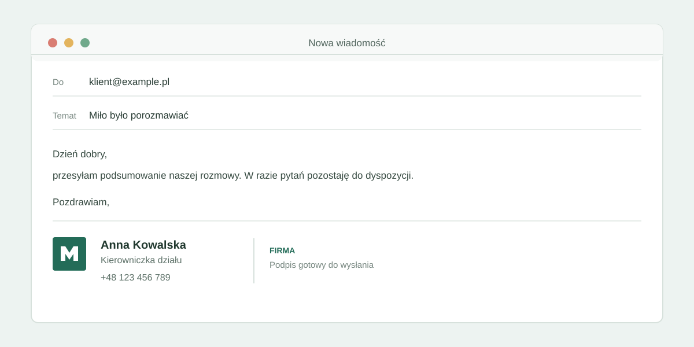

# Email signature Tool



A modern, opinionated starter template for building fast, accessible web applications.

## Tech Stack

- [Astro](https://astro.build/) v7 - Modern web framework with server-first rendering
- [React](https://react.dev/) v19 - UI library for interactive components
- [TypeScript](https://www.typescriptlang.org/) v6 - Type-safe JavaScript
- [Tailwind CSS](https://tailwindcss.com/) v4 - Utility-first CSS framework
- [Supabase](https://supabase.com/) - Authentication and backend-as-a-service
- [Cloudflare Workers](https://workers.cloudflare.com/) - Edge deployment runtime

## Prerequisites

- Node.js v26.3.0 (as specified in `.nvmrc`)
- npm (comes with Node.js)

## Getting Started

1. Clone the repository:

```bash
git clone https://github.com/lukaszsiwko-cell/email-signature-tool.git
cd email-signature-tool
```

2. Install dependencies:

```bash
npm install
```

3. Set up Supabase and configure environment variables — see [Supabase Configuration](#supabase-configuration) below.

4. Create a `.dev.vars` file for local Cloudflare dev secrets:

```bash
cp .env.example .dev.vars
```

5. Run the development server:

```bash
npm run dev
```

## Available Scripts

- `npm run dev` - Start development server (Cloudflare workerd runtime)
- `npm run build` - Build for production
- `npm run preview` - Preview production build
- `npm run lint` - Run ESLint with type-checked rules
- `npm run lint:fix` - Auto-fix ESLint issues
- `npm run format` - Run Prettier
- `npm run smoke` - Smoke test the auth flow against a running server (`BASE_URL`, defaults to `http://localhost:4321`)

## Project Structure

```md
.
├── src/
│ ├── layouts/ # Astro layouts
│ ├── pages/ # Astro pages
│ │ └── api/ # API endpoints
│ ├── components/ # UI components (Astro & React)
│ └── assets/ # Static assets
├── public/ # Public assets
├── wrangler.jsonc # Cloudflare Workers config
```

## Supabase Configuration

This project uses [Supabase](https://supabase.com/) for authentication. Environment variables are declared via Astro's `astro:env` schema and are treated as **server-only secrets** — they are never exposed to the client.

### First-time setup (local, no cloud project needed)

Requires [Docker](https://www.docker.com/) and ~7 GB RAM.

1. Create your `.env` file:

```bash
cp .env.example .env
```

2. Initialize the local Supabase project (creates a `supabase/` config folder):

```bash
npx supabase init
```

3. Start the local stack (downloads Docker images on first run):

```bash
npx supabase start
```

4. Copy the credentials printed by the CLI into your `.env` and `.dev.vars`:

```
SUPABASE_URL=http://127.0.0.1:54321
SUPABASE_KEY=<anon key from CLI output>
```

5. To stop the stack when done:

```bash
npx supabase stop
```

The local Studio UI is available at `http://localhost:54323`.

Supabase Auth uses its built-in `auth.users` table; project migrations create the department-scoped employee and signature-delivery tables.

### Using a cloud Supabase project instead

If you prefer to use a hosted Supabase project, add these variables to your `.env` and `.dev.vars` files:

| Variable       | Description                                                |
| -------------- | ---------------------------------------------------------- |
| `SUPABASE_URL` | Project URL from Supabase dashboard → Settings → API       |
| `SUPABASE_KEY` | `anon` public key from Supabase dashboard → Settings → API |

```
SUPABASE_URL=https://<project-ref>.supabase.co
SUPABASE_KEY=<anon-key>
```

### Resend

Signature delivery uses the [Resend SDK over HTTPS](https://resend.com/docs/send-with-cloudflare-workers), without SMTP sockets. Create an API key with sending access and [verify your sending domain](https://resend.com/domains). `EMAIL_FROM` must use that domain, not a `gmail.com` address. Store these server-only values in `.dev.vars` for local development and as Worker secrets/variables in Cloudflare:

| Variable         | Description                                                                                                                      |
| ---------------- | -------------------------------------------------------------------------------------------------------------------------------- |
| `RESEND_API_KEY` | Resend API key with sending access. Always store as a secret; never commit it.                                                   |
| `EMAIL_FROM`     | Sender address on your verified domain, for example `Signatures <signatures@your-domain.com>`.                                   |
| `PUBLIC_APP_URL` | Public base URL used to create recipient links; use `http://localhost:4321` locally and the deployed HTTPS origin in production. |

Example `.dev.vars` entries:

```dotenv
RESEND_API_KEY=your-resend-api-key
EMAIL_FROM="Signatures <signatures@your-domain.com>"
PUBLIC_APP_URL=http://localhost:4321
```

The email contains a one-time download link, not the generated signature files. If configuration is missing or Resend rejects the send, the app revokes the unused delivery token and reports a safe, actionable error. `onboarding@resend.dev` is only for testing with the recipient allowed by your Resend account, not for production delivery to employees.

For delivery failures, check the production Worker logs around the request time. The app logs Resend's safe error metadata or, if the SDK throws, the exception name/message and one cause (including a network error code when available); URLs, email addresses, and Resend API keys are redacted. It does not log message contents or recipient details.

### Installing a Thunderbird signature on Windows

Automatic installation requires Windows PowerShell 5.1 or newer (`powershell.exe`) and a Thunderbird profile with an existing email account. PowerShell 7 alone (`pwsh.exe`) is not sufficient for the launcher.

1. Download both the PowerShell installer (`.ps1`) and launcher (`.cmd`) into the same folder. The recipient page downloads `instalator-thunderbird.ps1` and `instalator-thunderbird.cmd`; the employee list uses employee-specific names with matching stems. Keep both names unchanged.
2. Save your work and close Thunderbird.
3. Open the `.cmd` file. It runs the `.ps1` installer and prompts for the Thunderbird profile and account.
4. Reopen Thunderbird and verify the signature in a new message.

The installer backs up the profile settings and existing signature before making changes. Administrator privileges are not required. Organizational execution policies remain enforced; contact IT if scripts are blocked. The launcher uses a UTF-16LE encoded PowerShell command to preserve Polish messages independently of the Windows command-shell code page.

Previously downloaded recipient launchers named `uruchom-instalator-thunderbird.cmd` expect a matching `uruchom-instalator-thunderbird.ps1`. Rename the accompanying `instalator-thunderbird.ps1` to that name to use the old pair, or download a fresh pair.

### Email confirmation in local development

By default Supabase requires email confirmation before a user can sign in. To skip this during local development:

1. Open the Supabase dashboard for your project
2. Go to **Authentication → Email → Confirm email**
3. Toggle it **off**

Users can then sign in immediately after sign-up without clicking a confirmation link.

### Auth routes

| Route                 | Description                                                             |
| --------------------- | ----------------------------------------------------------------------- |
| `/auth/signin`        | Email/password sign-in form                                             |
| `/auth/signup`        | Email/password sign-up form                                             |
| `/auth/confirm-email` | Post-signup "check your inbox" page                                     |
| `/dashboard`          | Example protected page (redirects to `/auth/signin` if unauthenticated) |

Route protection is handled in `src/middleware.ts`. Add paths to the `PROTECTED_ROUTES` array there to require authentication.

## Deployment

This project deploys to [Cloudflare Workers](https://workers.cloudflare.com/). See `context/deployment/deploy-plan.md` for the full step-by-step audit trail (account setup, secrets, verification).

### Manual deploy

```bash
npm run build
npx wrangler deploy
```

Set `SUPABASE_URL`, `SUPABASE_KEY`, `RESEND_API_KEY`, `EMAIL_FROM`, and `PUBLIC_APP_URL` for the Production Worker. Store `SUPABASE_URL`, `SUPABASE_KEY`, and `RESEND_API_KEY` as secrets; configure the remaining values as variables.

```bash
npx wrangler secret put SUPABASE_URL
npx wrangler secret put SUPABASE_KEY
npx wrangler secret put RESEND_API_KEY
```

### Automatic deploy on push to `master`

This project uses **Cloudflare Workers Builds' native Git integration** for auto-deploy — configured once in the Cloudflare dashboard (Workers & Pages → this Worker → Settings → Build → Connect to Git), not GitHub Actions. GitHub Actions (`.github/workflows/ci.yml`) only runs lint/`astro check`/build/smoke and does not deploy.

Configure these five values for the deployed Worker using Wrangler or the Cloudflare dashboard (Settings → Variables and Secrets). Production runtime values are separate from local `.dev.vars` and GitHub Actions secrets. `SUPABASE_URL`, `SUPABASE_KEY`, and `RESEND_API_KEY` are **Secrets**; `EMAIL_FROM` and `PUBLIC_APP_URL` are regular variables. Resend does not use a Cloudflare `send_email` binding.

### Post-deploy one-off: backfilling `profiles` for pre-existing accounts

The department-scoped data model (`profiles.department_id`) was added after this project's first deployment. Accounts that signed up before that migration have no `profiles` row and won't be able to use department-scoped features (employee list, etc.) until one is created for them. Run this once against production data, picking the correct department per user before running it:

```sql
insert into public.profiles (id, department_id)
select id, (select id from public.departments where name = 'IT') -- adjust per user before running in production
from auth.users
where id not in (select id from public.profiles);
```

This is a manual, one-off remediation step (per the interview decision) — there is no in-app UI for it.

## Smoke test

`scripts/smoke.mjs` is a dependency-free Node script that walks the whole auth flow (sign-up, sign-in, protected page, sign-out) over HTTP, plus the add/list-employee flow and cross-department data isolation (a second department's account must never see the first department's employees). Run it against the dev server or the production preview after dependency upgrades:

```bash
npm run dev            # or: npm run build && npm run preview
BASE_URL=http://localhost:4321 npm run smoke
```

It needs a reachable Supabase instance (local or cloud) with email confirmation disabled.

> **Note:** this script exists primarily to guard the development of the starter itself — it is a fast sanity check that dependency upgrades did not break the build, the Cloudflare adapter or the Supabase auth flow. It is **not** a substitute for a real test suite. Once you build your own product on top of this starter, add proper tests (unit, integration, end-to-end) suited to your application.

## CI

GitHub Actions runs two jobs on every push and PR to `master`:

- **ci** — lint, `astro check` and build. Configure `SUPABASE_URL` and `SUPABASE_KEY` as repository secrets for the build step.
- **smoke** — starts a local Supabase via the Supabase CLI, builds, serves the production preview on the Cloudflare runtime and runs `npm run smoke` against it. No secrets required.

## License

MIT
